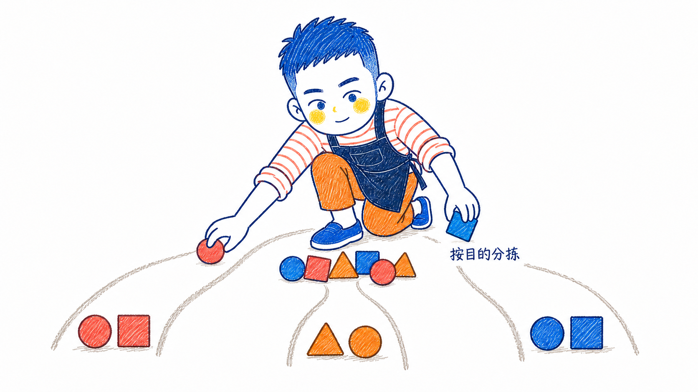
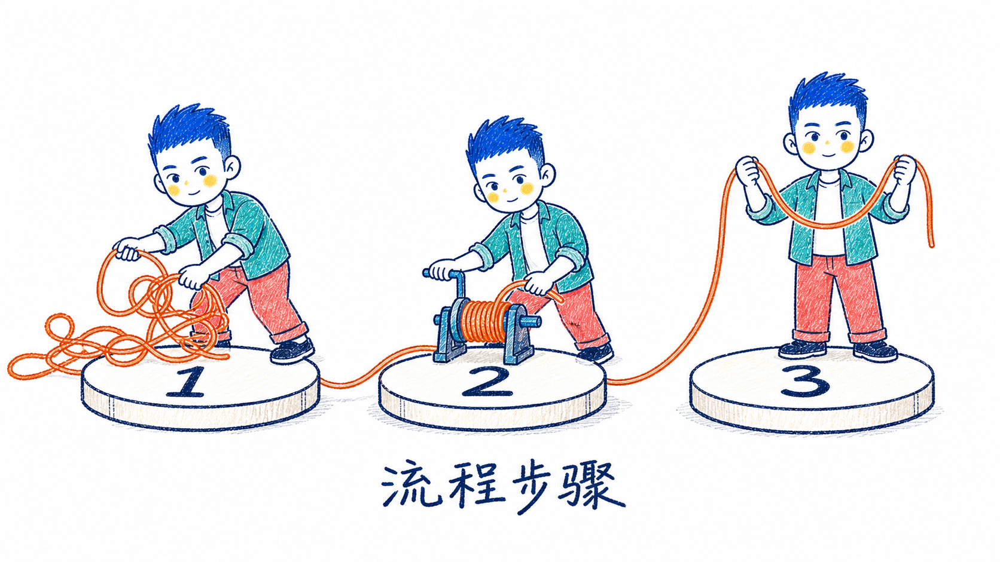
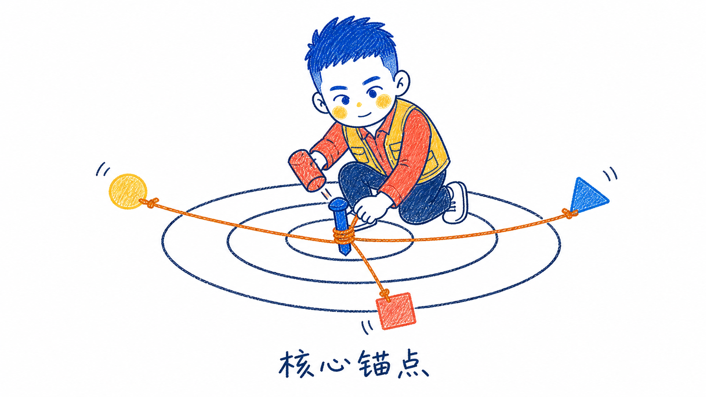

# Bornforthis Illustrations

Bornforthis 的中文正文配图 Skill。它沿用 Esther／不二插画的纯白蜡笔绘本视觉体系和 Ian 小黑正文配图的工作流，把文章中的判断、流程、结构、状态与隐喻转化为 16:9 横版手绘解释图。

角色固定的是身份，不是服饰：钴蓝短刺发、外扩圆耳、纸白圆方脸、黄色圆脸颊和极简蓝色五官保持一致；衣服、耳机、鞋、相机、包、书与其他配饰按每张图的语义重新设计。耳机不是默认标配。

## 能力

- 分析中文文章并选择真正需要插图的认知锚点。
- 先输出 1–9 张精简 shot list，或在用户明确要求时直接逐张生成。
- 使用纯白背景、蜡笔或马克笔斜线纹理、深蓝晃动描边、少量蓝红中文标注和大量留白。
- 让 Bornforthis 亲自完成核心动作，而不是站在一旁充当贴纸。
- 每次从当前正文重新发明隐喻，避免照抄内置样例。
- 生成后检查角色身份、画风、文字、构图、留白和可变服饰。

## 内置参考图

Skill 自带两类图片：

- `assets/references/`：2 张角色身份锚点。每次生成必须同时传入，只读取角色面孔、发型、耳朵、五官和比例。
- `assets/examples/`：14 张完成度参考图。仅用于低频校准白底、纹理、描边、留白、换装范围和角色参与度，不作为默认构图模板。

14 张样例覆盖：两个断点、按目的分拣、信息压缩、因果链条、抽象到具象、对比差异、流程步骤、核心锚点、笔记回流、信息井、创意压机、内容发酵、系统承重和信任桥。具体选择规则见 [`references/example-index.md`](references/example-index.md)。

## 示例画廊

| 01 两个断点 | 02 按目的分拣 |
|---|---|
|  |  |
| 03 信息压缩 | 04 因果链条 |
|  |  |
| 05 抽象到具象 | 06 对比差异 |
|  |  |
| 07 流程步骤 | 08 核心锚点 |
|  |  |
| 09 笔记回流 | 10 信息井 |
|  |  |
| 11 创意压机 | 12 内容发酵 |
|  |  |
| 13 系统承重 | 14 信任桥 |
|  |  |

## 安装

### 从仓库安装

```bash
git clone https://github.com/AndersonHJB/CodexSkills.git
mkdir -p ~/.codex/skills/bornforthis-illustrations
rsync -a --delete CodexSkills/skills/bornforthis-illustrations/ ~/.codex/skills/bornforthis-illustrations/
```

如果已经克隆仓库：

```bash
git -C CodexSkills pull --ff-only
mkdir -p ~/.codex/skills/bornforthis-illustrations
rsync -a --delete CodexSkills/skills/bornforthis-illustrations/ ~/.codex/skills/bornforthis-illustrations/
```

安装完成后，新建 Codex 会话或重启 Codex，使 Skill 列表重新加载。

## 使用

分析文章并先给配图策略：

```text
使用 $bornforthis-illustrations，分析这篇中文文章应该在哪些位置配图，先给我 shot list，不要生成图片。
```

直接生成：

```text
使用 $bornforthis-illustrations，为这篇中文文章设计并生成 Bornforthis 蜡笔手绘正文配图。服装与配饰根据每张图的主题变化，不要默认添加耳机。
```

编辑已有配图：

```text
使用 $bornforthis-illustrations，删除这张图左上角的类型标题，保留 Bornforthis、构图、其余文字和蜡笔纹理不变。
```

## 目录

```text
bornforthis-illustrations/
├── SKILL.md
├── README.md
├── THIRD_PARTY_NOTICES.md
├── agents/
│   └── openai.yaml
├── assets/
│   ├── references/    # 2 张必传身份锚点
│   └── examples/      # 14 张低频成品校准图
└── references/
    ├── bornforthis-ip.md
    ├── style-dna.md
    ├── composition-patterns.md
    ├── prompt-template.md
    ├── qa-checklist.md
    └── example-index.md
```

详细执行规则以 [`SKILL.md`](SKILL.md) 为准。

上游许可与归属见 [`THIRD_PARTY_NOTICES.md`](THIRD_PARTY_NOTICES.md)。
